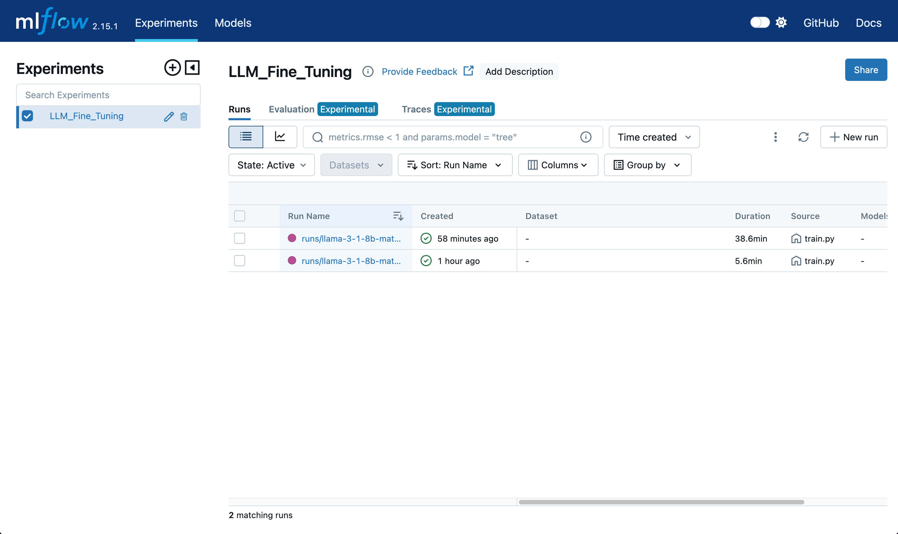

# LLM Fine-tuning with SkyPilot and MLflow

This repository demonstrates how to efficiently orchestrate Large Language Model (LLM) fine-tuning using SkyPilot for resource management and MLflow for experiment tracking. The example showcases fine-tuning LLaMA 3 8B model using the Orca Math dataset.

## Prerequisites

- Python 3.10+
- Access to a Kubernetes cluster or cloud provider supported by SkyPilot
- MLflow tracking server (can be self-hosted or managed service like [Nebius AI MLflow](https://nebius.com/services/managed-mlflow))
- Hugging Face account and access token for [LLaMA 3.1 models](https://huggingface.co/collections/meta-llama/llama-31-669fc079a0c406a149a5738f)


## Installation

1. Install SkyPilot with Kubernetes support:
```bash
pip install "skypilot[kubernetes]"
```

2. Configure environment variables by creating a `.env` file:

```bash
MLFLOW_TRACKING_URI=https://your-mlflow-server
MLFLOW_TRACKING_SERVER_CERT_PATH=/path/to/cert.pem # needs to be downloaded or synced to the SkyPilot cluster
MLFLOW_ENABLE_SYSTEM_METRICS_LOGGING=true
MLFLOW_EXPERIMENT_NAME=LLM_Fine_Tuning
MLFLOW_TRACKING_USERNAME=your-username
MLFLOW_TRACKING_PASSWORD=your-password
HF_TOKEN=your-huggingface-token
# TEST_MODE=true  # Uncomment for development. This will use a smaller subset of the dataset.
```

## Project Structure

```
.
├── generate_train_dataset.py  # Script to prepare training data
├── requirements.txt          # Project dependencies
├── sky.yaml                 # SkyPilot configuration
├── train.py                # Main training script
└── recipes/                # Training configurations
    ├── llama-3-1-8b-qlora.yaml     # QLoRA fine-tuning config
    ├── llama-3-1-8b-spectrum.yaml  # Spectrum fine-tuning config
    └── spectrum_config/           # Spectrum-specific configurations
```

## Running the Training

1. Generate the training dataset:
```bash
python generate_train_dataset.py
```

2. Launch initial training job:
```bash
sky launch -c dev sky.yaml --env-file .env
```

3. For subsequent training runs on the same cluster:
```bash
sky exec dev sky.yaml --env-file .env
```


### Useful SkyPilot Commands

- Monitor cluster status: `sky status`
- Stop the cluster: `sky down dev`
- Connect to cluster via SSH: `ssh dev`
- View logs: `sky logs dev`

## Training Configurations

The repository includes two main training configurations:

1. QLoRA (Quantized Low-Rank Adaptation):
   - Uses 4-bit quantization
   - Applies LoRA to all linear layers
   - Configured in `recipes/llama-3-1-8b-qlora.yaml`

2. Spectrum:
   - Selectively unfreezes specific model layers
   - Uses a cosine learning rate schedule
   - Configured in `recipes/llama-3-1-8b-spectrum.yaml`

## MLflow Integration

The training script integrates with MLflow to track:

- Training metrics (loss, learning rate, batch size, training speed)
- System metrics (GPU utilization, memory usage, CPU usage)
- Model parameters and configurations
- Training artifacts

Access the MLflow UI through your configured tracking server to monitor experiments.

#### Experiment Overview


#### Run Details


#### Training Metrics


#### System Metrics


## Acknowledgments

This project is based on Philipp Schmid's "[How to fine-tune open LLMs in 2025](https://www.philschmid.de/fine-tune-llms-in-2025)" blog post and extends it with SkyPilot and MLflow integration.